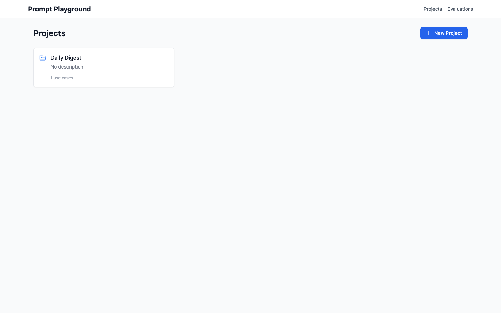
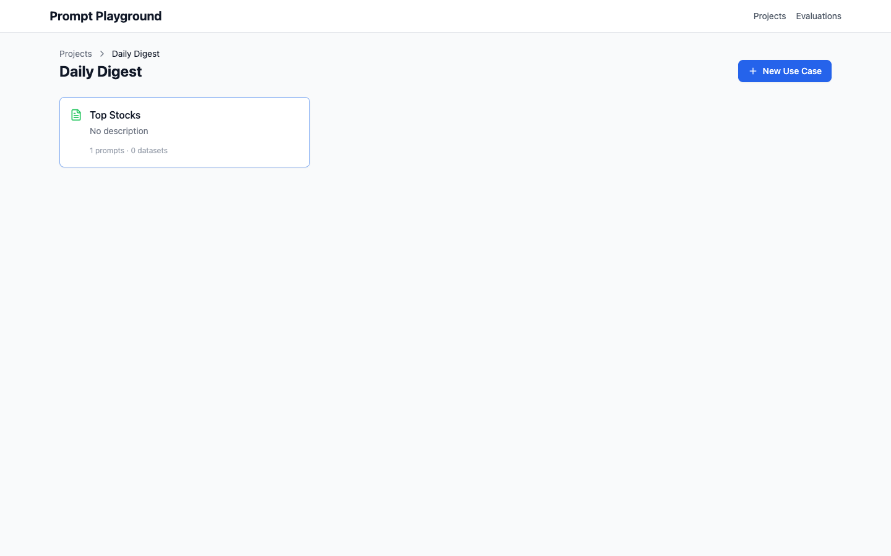
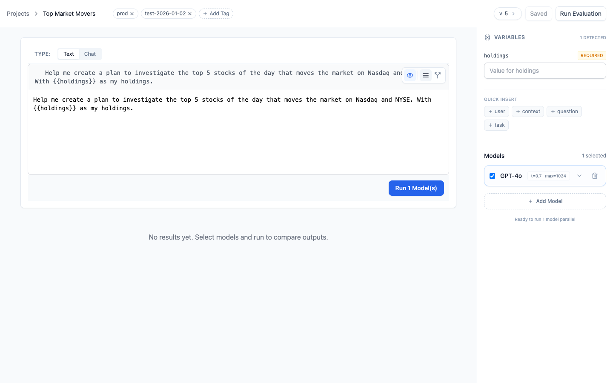
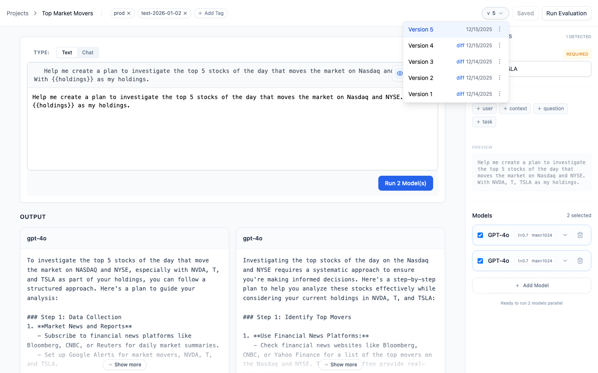
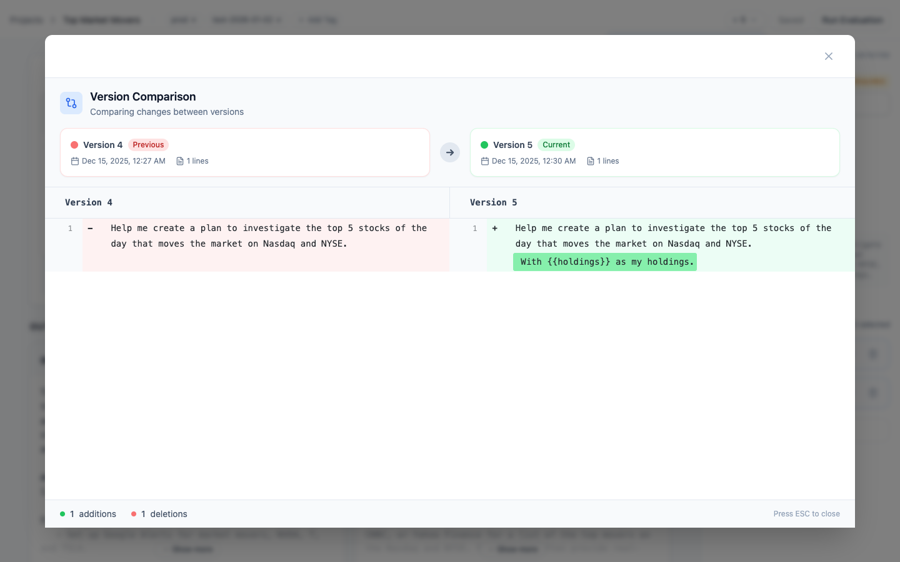
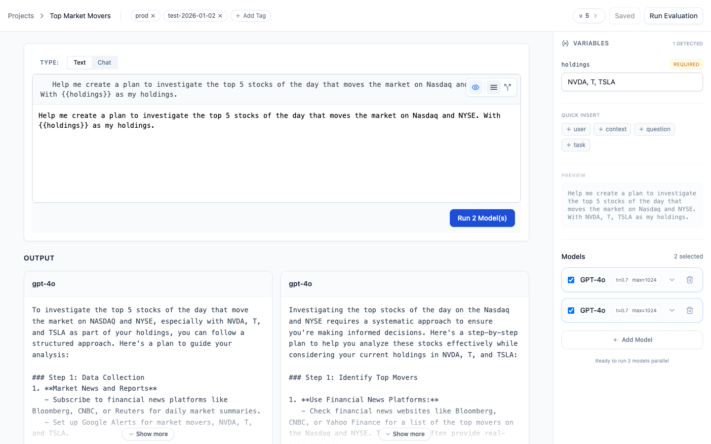
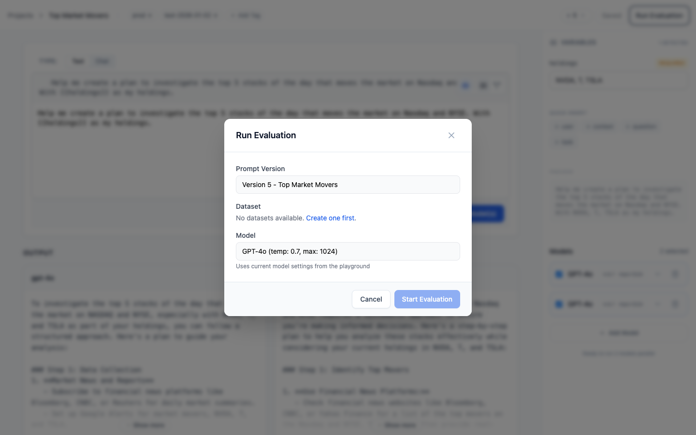
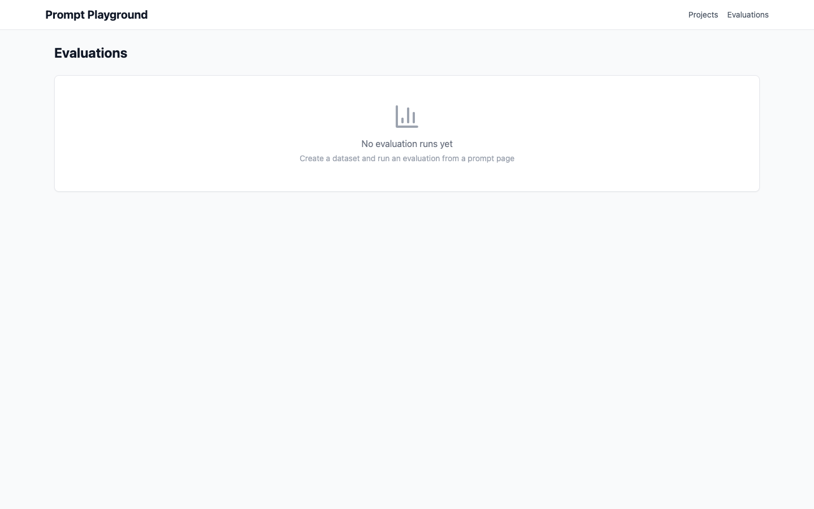

# Prompt Playground - User Guide

Welcome to the Prompt Playground! This guide will help you navigate the application, manage your prompts, and run evaluations to ensure high-quality outputs.

## Live Demo
> [!NOTE]
> Detailed walkthrough of the application flows:
> 

## 1. Projects Dashboard
The **Projects** page is your home base. Here you can see all your active projects and their high-level statistics.
- **Projects**: Group your work by domain or application.
- **Stats**: Quickly see the number of use cases in each project.

## 2. Organizing Work
Within a Project, you organize work into **Use Cases**.
- **Use Case**: Represents a specific feature or task (e.g., "Summarization", "Classification").
- **Prompts & Datasets**: Each use case contains its own prompts and test datasets.

## 3. The Prompt Studio
The **Prompt Studio** is the core editing environment.
- **Editor**: A powerful, Monaco-based editor for your prompt templates. Supports both "Text" and "Chat" modes.
- **Variables**: Define variables using bracket syntax `{{variable}}`. They appear in the "Variables" panel for easy testing.
- **Models**: Select one or multiple models to test against. Configure parameters like `Temperature` and `Max Tokens`.
- **Tags**: Add tags to organize and filter your prompts.

## 4. Version Control
Never lose your work. Prompt Playground provides robust versioning for every prompt.
- **Save Version**: Commit your changes with a new version number.
- **Version Selector**: Switch between versions using the dropdown.
- **Blue/Green Dots**: Quickly identify "Production" (Green) and "Latest" (Blue) versions.

### Comparing Versions
Use the **Diff View** to see exactly what changed between two versions.
- **Green**: Added lines.
- **Red**: Removed lines.

## 6. Multi-Model Testing
Compare how different models respond to the same prompt instantly.
- **Add Model**: Click "Add Model" in the right panel to configure a second (or third) model card.
- **Configure**: Set different models (e.g., GPT-4 vs GPT-3.5) or parameters (Temperature) for each card to run side-by-side comparisons.

## 7. Evaluation & Testing
Ensure your prompts perform well by running evaluations.
- **Run Evaluation**: Click the "Run Evaluation" button to test your prompt against configured models.
- **Datasets**: Select a test dataset to run batch evaluations (coming soon).

### Analyzing Results
View the outputs of your evaluation runs side-by-side to compare model performance, cost, and latency.

